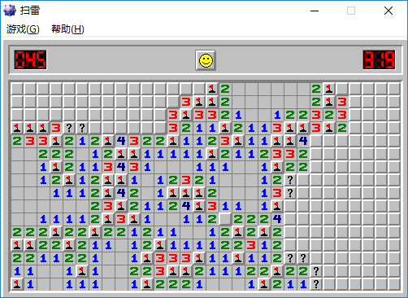
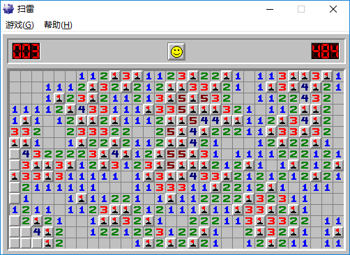

# minesweeper-bot

## 推断策略

在模拟XP高级模式下，开局位置为四角时，以下策略胜率为37.5%，

略微高于 [MineSweeper Solver](http://www.wsdh.org/?minesweeper) 用现实中XP扫雷测试的36.4%。

### 单格推断

* 根据一个数字格和周围格子情况，推断这些格子是否全是雷或都安全
* 在一局完整的高级游戏中平均使用约25遍（遍历所有格算一遍）
* 点开的面积平均占单局总点开面积的65%

### 双格推断

* 根据两个相邻的数字格及周围格子情况，推断这些格子中雷的位置
* 在一局完整的高级游戏中平均使用约11遍
* 点开的面积平均占单局总点开面积的28%

只有单格信息甚至不能推断如1-2-1和1-2-2-1定式的雷位置。  
双格推断需要用到与两个数字都相邻的未知格，简称公共格（或公共区）。  
计算公共区可放雷数的上下限，再与数字比较即有望确定数字周围的非公共格的情况。

例如下图中标有“?”的即为某两个相邻数字的公共区。  
左上部“?”下面的2说明公共区最少有1个雷，再根据“?”下的1可推出其右上方安全。  
右中部“?”左边的2说明公共区最多有1个雷，再根据“?”左的3可推出其右下方是雷。  
右下部“?”很多，显然拐角2的右上方安全，但一次双格推断无法确定此位置，需要多格推断。

### 多格推断

* 通过在数字格周围模拟放雷，得到所有可行的雷排布，由此计算各格子是雷的概率
* 在一局完整的高级游戏中平均使用约5次
* 点开的面积平均占单局总点开面积的7%

三格及以上的确定性推断要考虑的情形变多，只得暴力破解。  
在模拟可行排布时，要考虑局面的总雷数和每个数字周围可以放的雷数。  
模拟完数字格周围，还要根据不在数字旁的未知格数量，用排列组合算总概率。  
由于确定的雷基本已在单格/双格推断中得出，计算出的概率一般达不到100%（遇二选一只有50%）。

例如在下图中，左下角还有3个未知的雷，且互相关联的数字至少有8个。  
尝试在左起第二列中部的数字4左边放雷，但发现要满足所有数字得用4个雷。  
因此只能在上述4的左下方的格放一个雷，此时能够找到用3个雷满足所有数字的排布。

## 使用说明

建议使用GCC 4.2以上版本编译（需要OpenMP）：

    gcc main_tester.c logic_kernel.c guess_kernel.c -fopenmp

若MinGW编译时提示找不到libwinpthread-1.dll，可能因为没把 `安装目录/mingw/bin` 添加到环境变量

---

PS：此程序还没有控制鼠标玩扫雷的功能